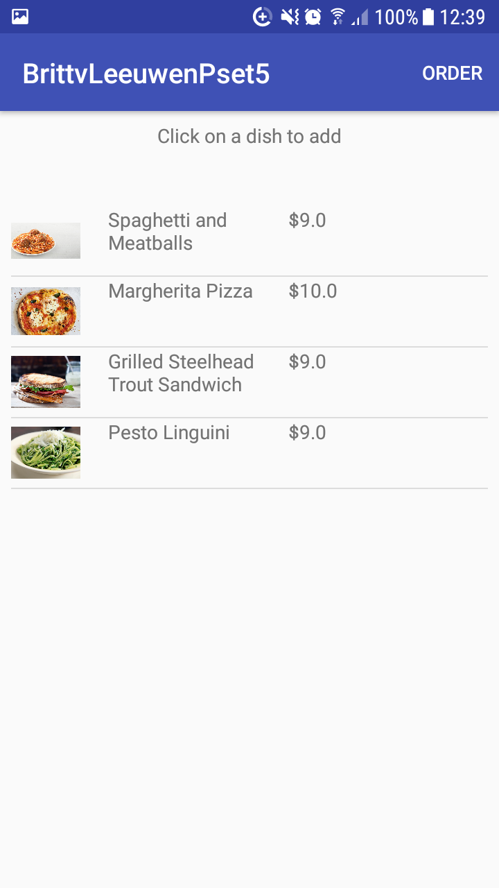

# BrittvLeeuwenPset5

This app helps users look at a restaurant’s menu and compose an order of items, as well as allow them to “submit” the order
and receive an estimated waiting time for this order. Of course, the user is able to view the price of items and the total
price of the order! All of this is done using an elegant and simple user interface.

